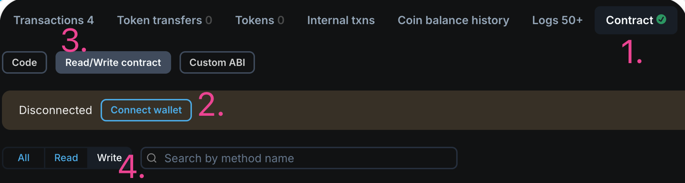
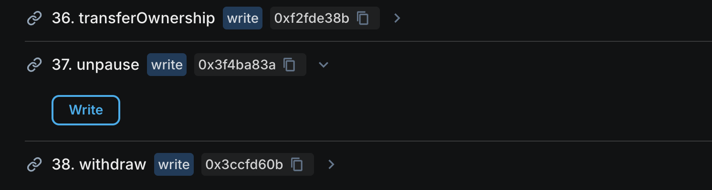

## How to unpause a contract
Go to Soneium [Blockscout](https://soneium.blockscout.com/) and find the contract you want to unpause. You have to have owners account to unpause a contract. Find your project [here](https://maar-io.github.io/migration-status/)

1. Go to Contract tab
2. Connect a wallet (like MetaMask) with your owner's account
3. Go to Read/Write Contract tab 
4. Go to Write Contract tab (optional)

5. Find the function `unpause` and click on Write button
5. Confirm the transaction in your wallet
5. Verify [here](https://maar-io.github.io/migration-status/) that your project is unpaused (reload the page)
   

